# General stuff
This produces a swagger file when run from the projects root folder.

`protoc --swagger_out=logtostderr=true,use_go_templates=true:. -I/pathto/googleapis -I. library/*/*.proto`

Where we can set flags by:
`--<tool_suffix>_out=<flags>:<path>`

Read more about the flags that can be set with the following commands
`protoc-gen-swagger --help`
or
`protoc-gen-grpc-gateway --help`

If you haven't recently updated `protoc_gen_swagger` run:

```bash
go get -u github.com/grpc-ecosystem/grpc-gateway/protoc-gen-swagger
```

Otherwise you could get a happy error message:
`Error while parsing option value for "openapiv2_operation": Message type "_swagger.options.Response" has no field named "examples".`

Examples are based on the `library.proto` that can be found [here](https://github.com/googleapis/googleapis/blob/master/google/example/library/v1/library.proto).

# Availible options

```java
option (grpc.gateway.protoc_gen_swagger.options.[kind of option]) = {
  ...
}
```

Availiable options are:
- `openapiv2_swagger`
  - File options
- `openapiv2_operation`
  - Method options
- `openapiv2_schema`
  - Message options
- `openapiv2_tag`
  - Service option
- `openapiv2_field`
  - Field options

# Results

This section will contain the combined tables of each annotation option that has been tested.

The **key** column represents the swagger key in the swagger file.

### Swagger

The general options for the swagger file.

Example:
```java
option (grpc.gateway.protoc_gen_swagger.options.openapiv2_swagger) = {
  info: {
    title: "Library Example API";
    version: "1.0";
    description: "Awesome API description right here. Could be longer, could be shorter."
  };
  [...]
}
```

| Key                  | Proto | Result OAS2                        | Result readme                           | Ok  | Notes                                                                         |
| :--:                 | :---: | :---------:                        | :-----------:                           | :-: | --                                                                            |
| info                 | -     | 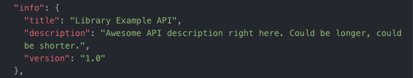 | 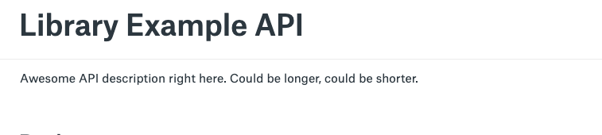 |     | If used, description needs to be set. Otherwise shows as undefined in readme. |
| securityDefinitions | -     | 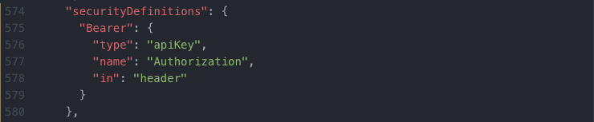      | See next                             |     |                                                                               |
| security             | -     | 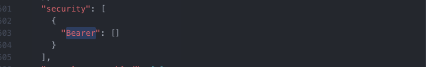          | 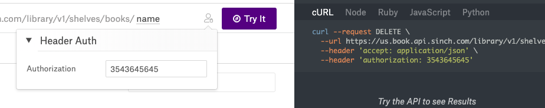            |     | Does not work well - looking at the example code shows `--header 'authorization: {token}'`, should be `--header 'authorization: Bearer {token}'`. |
| host and basepath    | -     |       |         |     |
| extensions   |   |   |   | Y  | Works well.  |

### Method

We go thorugh the method options, or operation options, here.

Example

```java
rpc ListBooks(ListBooksRequest) returns (ListBooksResponse) {
  option (google.api.http) = {
    get: "/v1/shelves/{name}/books"
  };
  option (grpc.gateway.protoc_gen_swagger.options.openapiv2_operation) = {
    [...]
  };
}
```

| Key | Proto | Result OAS2 | Result readme |  Ok | Notes |
| :--: | :---: | :---------: | :-----------: | :-: | -- |
| tags   | - |   |  | Y | |
| responses | 200 | 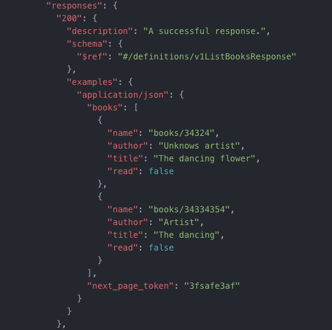 | 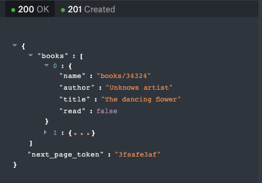 |   |   |
| responses   | 200 | See above  |  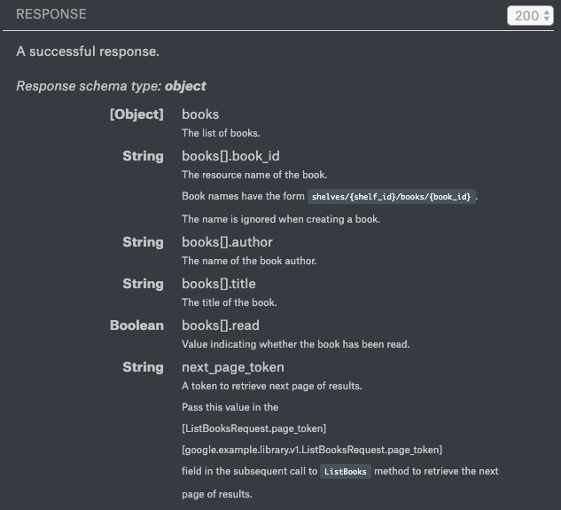 |   |   |
| responses   | 503 |  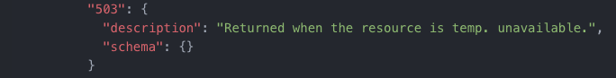 | 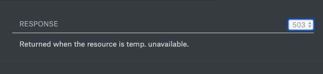  |   |   |
| deprecated    | -     | As expected                                     | No indication of it being deprecated | N   |                                          |
| description   | -     | As expected but overwrites description in proto |                                      |     | Should probably use description in proto |
| externalDocs | -     | Shows in OAS2                                   | Is not shown in readme               |     |                                          |
| summary       | -     | Overwrites summary set in proto |                                      |     |                                          |

### Message

| Key         | Proto                     | Result OAS2 | Result readme                   | Ok  | Notes                                      |
| :--:        | :---:                     | :---------: | :-----------:                   | :-: | --                                         |
| title       | The book                  | -           | 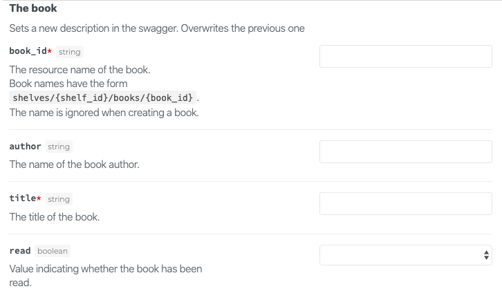 |     | Should use proto to set title, not options |
| description | Sets a new description... | -           | See above                       |     | Should use proto to set title, not options |
| required    | -                         | -           | See above                       |     | Currently seems to be the best way to set required fields. |
| example |       | As expected | Not shown, shows in Swagger UI |     | 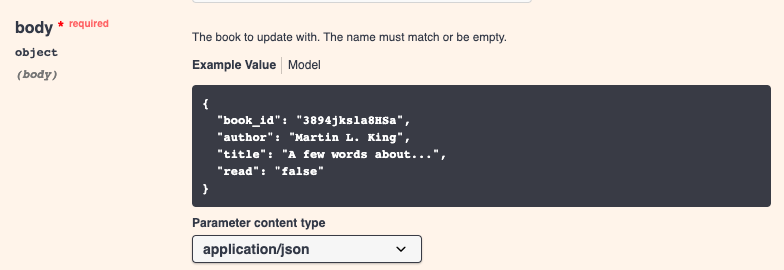 |
| externalDocs | -     | As expected | Does not show | N   |       |

### Service

**missing**

### Field
| Key         | Proto                     | Result OAS2 | Result readme                   | Ok  | Notes                                      |
| :--:        | :---:                     | :---------: | :-----------:                   | :-: | --                                         |
| required   |   |   |   |  N  | Is not supported for properties in OAS2/OAS3 |
| description   | |   |   | Y  |   |
|  minItems/maxItems  |   | 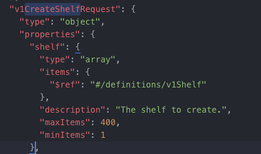  |   |  N  |  |
|   maxLength/maxItems | |   |   |  N |  Not supported in readme |
| enum   | -  | |   |   |  Contains the proto default value, field 0 in the enum (i.e. *UNKNOWN_*)   |

#### FieldMask

The swagger generation ignores fields in a message containing `google.protobuf.FieldMask <field_name>`.

#### OneOf

Is not supported by the swagger generation tool.

It will list the `oneof` properties from the proto as properties in the OAS2 file.

# Testing

These are the `.proto` annotations used to set different options, and in the table below, the results.

## File Options

Should go directly beneath the import and option statements at the top level.
These options set properties of the swagger file.

```java
option (grpc.gateway.protoc_gen_swagger.options.openapiv2_swagger) = {
  info: {
    title: "Library Example API";
    version: "1.0";
    description: "Awesome API description right here. Could be longer, could be shorter."
  };
  security_definitions: {
    security: {
      key: "Bearer";
      value: {
        type: TYPE_API_KEY;
        name: "Authorization";
        in: IN_HEADER
      }
    }
  }
  security: { //Global security
    security_requirement: {
      key: "Bearer";
      value: {};
    }
  }
  host: "us.book.api.sinch.com"
  base_path: "/library";
  extensions: {
    key: "x-explorer-enabled"
    value {
      bool_value: true;
    }
  }
  extensions: {
    key: "x-samples-enabled"
    value {
      bool_value: true;
    }
  }
};
```

| Key                  | Proto | Result OAS2                        | Result readme                           | Ok  | Notes                                                                         |
| :--:                 | :---: | :---------:                        | :-----------:                           | :-: | --                                                                            |
| info                 | -     |  |  |     | If used, description needs to be set. Otherwise shows as undefined in readme. |
| securityDefinitions | -     |       | See next                             |     |                                                                               |
| security             | -     |           |             |     | Does not work well - looking at the example code shows `--header 'authorization: 3543645645'`, should be `--header 'authorization: Bearer 3543645645'`. |
| host and basepath    | -     |       |         |     |                                                                               |

### Other

Any important ones missing?

## Method Options

### Tags

```java
rpc GetShelf(GetShelfRequest) returns (Shelf) {
  option (google.api.http) = {
    get: "/v1/{name}"
  };
  option (grpc.gateway.protoc_gen_swagger.options.openapiv2_operation) = {
    tags: "Shelves";
  };
}
```

| Key | Proto | Result OAS2 | Result readme |  Ok | Notes |
| :--: | :---: | :---------: | :-----------: | :-: | -- |
| tags   | - |   |  | Y | |

### Responses

```java
rpc ListBooks(ListBooksRequest) returns (ListBooksResponse) {
  option (google.api.http) = {
    get: "/v1/shelves/{name}/books"
  };
  option (grpc.gateway.protoc_gen_swagger.options.openapiv2_operation) = {
    tags: "Books";
    responses: {
      key: "200";
      value: {
        examples: {
          key: "application/json"
          value: '{"books": [{"name": "books/34324","author": "Unknows artist","title": "The dancing flower","read": false},{"name": "books/34334354","author": "Artist","title": "The dancing","read": false}],"next_page_token":"3fsafe3af"}'
        }
      }
    }
    responses: {
      key: "503";
      value: {
        description: "Returned when the resource is temp. unavailable.";
      }
    }
  };
}
```

| Key | Code | Result OAS2 | Result readme |  Ok | Notes |
| :--: | :---: | :---------: | :-----------: | :-: | -- |
| responses | 200 |  |  |   |   |
| responses   | 200 | See above  |   |   |   |
| responses   | 503 |   |   |   |   |

### Others

```java
rpc MoveBook(MoveBookRequest) returns (Book) {
  option (google.api.http) = {
    post: "/v1/shelves/books/{name}:move"
    body: "*"
  };
  option (grpc.gateway.protoc_gen_swagger.options.openapiv2_operation) = {
    tags: "Books";
    deprecated: true;
    summary: "Move"
    description: "Description MoveBook"; //Overwrites description in proto
    external_docs: {
      url: "https://developers.sinch.com/docs";
      description: "Find out more MoveBook";
    }
  };
}
```

| Key           | Proto | Result OAS2                                     | Result readme                        | Ok  | Notes                                    |
| :--:          | :---: | :---------:                                     | :-----------:                        | :-: | --                                       |
| deprecated    | -     | As expected                                     | No indication of it being deprecated | N   |                                          |
| description   | -     | As expected but overwrites description in proto |                                      |     | Should probably use description in proto |
| externalDocs | -     | Shows in OAS2                                   | Is not shown in readme               |     |                                          |
| summary       | -     | Overwrites summary set in proto |                                      |     |                                          |

Probably better to use the proto to set summary and description.

```java
// Move book <-- set summary in OAS2
//
// Moves a book to another shelf, and returns the new book. The book
// id of the new book may not be the same as the original book. <-- description in OAS2
```

## Message Options

### No options

```java
// A book
//
// A single book in the library.
message Book {
  option (google.api.resource) = {
    type: "library-example.googleapis.com/Book",
    pattern: "shelves/{shelf_id}/books/{book_id}"
  };
  // The resource name of the book.
  // Book names have the form `shelves/{shelf_id}/books/{book_id}`.
  // The name is ignored when creating a book.
  string book_id = 1;

  // The name of the book author.
  string author = 2;

  // The title of the book.
  string title = 3;

  // Value indicating whether the book has been read.
  bool read = 4;
}
```

| Key | Proto | Result OAS2 | Result readme |  Ok | Notes |
| :--: | :---: | :---------: | :-----------: | :-: | -- |
|  title | A book |   | 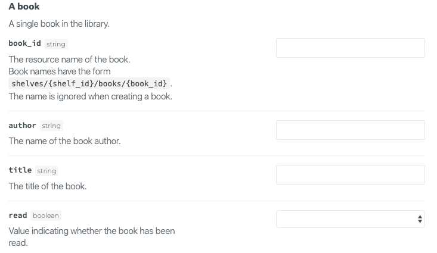  |   |   |
| description   | A single book in the library  |   | See above  |   |   |

### Set title, description and required fields

```java
// A book
//
// A single book in the library.
message Book {
  option (grpc.gateway.protoc_gen_swagger.options.openapiv2_schema) = {
    json_schema: {
        title: "The book"
        description: "Sets a new description in the swagger. Overwrites the previous one"
        required: ["book_id", "title"]
    }
};
  option (google.api.resource) = {
    type: "library-example.googleapis.com/Book",
    pattern: "shelves/{shelf_id}/books/{book_id}"
  };
  [...]
}
```

| Key         | Proto                     | Result OAS2 | Result readme                   | Ok  | Notes                                      |
| :--:        | :---:                     | :---------: | :-----------:                   | :-: | --                                         |
| title       | The book                  | -           |  |     | Should use proto to set title, not options |
| description | Sets a new description... | -           | See above                       |     | Should use proto to set title, not options |
| required    | -                         | -           | See above                       |     | Currently seems to be the best way to set required fields. |

### external docs

```java
// A book
//
// A single book in the library.
message Book {
  option (grpc.gateway.protoc_gen_swagger.options.openapiv2_schema) = {
    external_docs: {
			url: "https://developers.sinch.com/docs";
			description: "Find out more about Book";
		}
};
  option (google.api.resource) = {
    type: "library-example.googleapis.com/Book",
    pattern: "shelves/{shelf_id}/books/{book_id}"
  };

  [...]
}
```
| Key          | Proto | Result OAS2 | Result readme | Ok  | Notes |
| :--:         | :---: | :---------: | :-----------: | :-: | --    |
| externalDocs | -     | As expected | Does not show | N   |       |

### example

```java
// A book
//
// A single book in the library.
message Book {
  option (grpc.gateway.protoc_gen_swagger.options.openapiv2_schema) = {
    example: {
      value: '{"book_id": "3894jksla8HSa", "author": "Martin L. King", "title": "A few words about...", "read": "false"}'
    }
};
  option (google.api.resource) = {
    type: "library-example.googleapis.com/Book",
    pattern: "shelves/{shelf_id}/books/{book_id}"
  };
  [...]
}
```

| Key     | Proto | Result OAS2 | Result readme                  | Ok  | Notes          |
| :--:    | :---: | :---------: | :-----------:                  | :-: | --             |
| example |       | As expected | Not shown, shows in Swagger UI |     |  |

## Service Options

These should work, but they are not in the generated swagger file.

```java
service LibraryService {
  option (grpc.gateway.protoc_gen_swagger.options.openapiv2_tag) = {
    description: "This will overwrite the description of the service in OAS2"
    external_docs: {
      url: "developers.sinch.com"
      description: "Find out more about Sinch find a number in a book! It's awsome!!"
    }
  };
  [...]

}
```

| Key        | Proto | Result OAS2 | Result readme | Ok  | Notes |
| :--:        | :---: | :---------: | :-----------: | :-: | --    |
| **missing** | -     | -           | -             | -   |- |

## Field Options

### required and description

```java
// A book
//
// A single book in the library.
message Book {
  [...]
  // The resource name of the book.
  // Book names have the form `shelves/{shelf_id}/books/{book_id}`.
  // The name is ignored when creating a book.
  string book_id = 1 [
    (grpc.gateway.protoc_gen_swagger.options.openapiv2_field) = {
      description: "Resource name of the book. Overwrites description from proto"
      required: ['book_id']
    }
  ];

  [...]
}
```

| Key | Proto | Result OAS2 | Result readme |  Ok | Notes |
| :--: | :---: | :---------: | :-----------: | :-: | -- |
| required   |   |   |   |  N  | Is not supported for properties in OAS2/OAS3 |
| description   | |   |   | Y  |   |

### array minItems, maxItems

```java
// Request message for LibraryService.CreateShelf.
message CreateShelfRequest {
  option (grpc.gateway.protoc_gen_swagger.options.openapiv2_schema) = {
    json_schema: {
        required: ["shelf"]
    }
};
  // The shelf to create.
  repeated Shelf shelf = 1[(grpc.gateway.protoc_gen_swagger.options.openapiv2_field) = {
      min_items: 1,
      max_items: 400
    }];

  // First category for the shelf.
  Category firstCategory = 2;
}
```

| Key | Proto | Result OAS2 | Result readme |  Ok | Notes |
| :--: | :---: | :---------: | :-----------: | :-: | -- |
|  minItems/maxItems  |   |   |   |  N  |  |
|   maxLength/maxItems | |   |   |  N |  Not supported in readme |

### enums

Removing the safe default option is not possible at the moment.

Example input:

```java
enum Type {
    UNKNOWN = 0;
    FOO = 1;
    BAR = 2;
}
```

Output:

```json
"Type": {
  "type": "string",
  "enum": [
    "UNKNOWN",
    "FOO",
    "BAR"
  ],
  "default": "UNKNOWN"
}
```

Expected:

```java
"Type": {
  "type": "string",
  "enum": [
    "FOO",
    "BAR"
  ]
}
```

## FieldMask

If we want to use a FieldMask to do a partial update we would for example do something like this:

```java
[...]
// Get settings for user
//
// Get the user settings.
rpc GetSettings(GetSettingsRequest) returns (Settings) {
  option (google.api.http) = {
    get: "/v1/{name}"
  };
  option (grpc.gateway.protoc_gen_swagger.options.openapiv2_operation) = {
    tags: "Settings";
  };
}

// Update user settings
//
// Updates the user settings.
rpc UpdateSettings(UpdateSettingsRequest) returns (Settings) {
  option (google.api.http) = {
    patch: "/v1/{settings.name}"
    body: "settings"
  };
  option (grpc.gateway.protoc_gen_swagger.options.openapiv2_operation) = {
    tags: "Settings";
  };
}

[...]
```

```java
[...]
// Settings
//
// The settings object
message Settings {
  string name = 1;
  // Settings fields omitted.
}

[...]

// Update settings
//
// Update settings for a user
message UpdateSettingsRequest {
  Settings settings = 1;
  // Field mask to support partial updates.
  google.protobuf.FieldMask update_mask = 2;
}

[...]
```

Which then results in the OAS2, not containing the `update_mask` field:

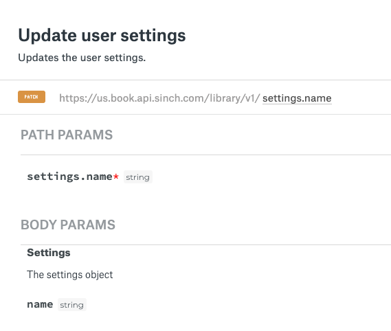

```json
"/v1/{settings.name}": {
  "patch": {
    "summary": "Update user settings",
    "description": "Updates the user settings.",
    "operationId": "UpdateSettings",
    "responses": {
      "200": {
        "description": "A successful response.",
        "schema": {
          "$ref": "#/definitions/v1Settings"
        }
      },
      "default": {
        "description": "An unexpected error response",
        "schema": {
          "$ref": "#/definitions/runtimeError"
        }
      }
    },
    "parameters": [
      {
        "name": "settings.name",
        "in": "path",
        "required": true,
        "type": "string"
      },
      {
        "name": "body",
        "in": "body",
        "required": true,
        "schema": {
          "$ref": "#/definitions/v1Settings"
        }
      }
    ],
    "tags": [
      "Settings"
    ]
  }
}
},
```

## oneof

Example proto:

```java
// Describes what book to move (name) and what shelf we're moving it
// to (other_shelf_name).
message MoveBookRequest {
  // The name of the book to move.
  string name = 1;

  oneof oneof_shelf{
    // The name of the destination shelf.
    string other_shelf_name = 2;

    // The id of the destination shelf
    string other_shelf_id = 3;
  }

}
```

Resulting OAS2:

```json
"v1MoveBookRequest": {
  "type": "object",
  "properties": {
    "name": {
      "type": "string",
      "description": "The name of the book to move."
    },
    "other_shelf_name": {
      "type": "string",
      "description": "The name of the destination shelf."
    },
    "other_shelf_id": {
      "type": "string",
      "title": "The id of the destination shelf"
    }
  },
  "description": "Describes what book to move (name) and what shelf we're moving it\nto (other_shelf_name)."
},
```


## Bonus

### Auto generated table
