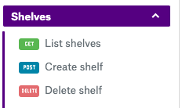

# General stuff
This produces a swagger file when run from the projects root folder.

`protoc --swagger_out=logtostderr=true,use_go_templates=true:. -I/pathto/googleapis -I. library/*/*.proto`

Where we can set flags by:
`--<tool_suffix>_out=<flags>:<path>`

Read more about the flags that can be set with the following commands
`protoc-gen-swagger --help`
or
`protoc-gen-grpc-gateway --help`

If you haven't recently updated `protoc_gen_swagger` run:

```bash
go get -u github.com/grpc-ecosystem/grpc-gateway/protoc-gen-swagger
```

Otherwise you could get a happy error message:
`Error while parsing option value for "openapiv2_operation": Message type "_swagger.options.Response" has no field named "examples".`

Examples are based on the `library.proto` that can be found [here](https://github.com/googleapis/googleapis/blob/master/google/example/library/v1/library.proto).

# Availible options

```java
option (grpc.gateway.protoc_gen_swagger.options.[kind of option]) = {
  ...
}
```

Availiable options are:
- `openapiv2_swagger`
  - File options
- `openapiv2_operation`
  - Method options
- `openapiv2_schema`
  - Message options
- `openapiv2_tag`
  - Service option
- `openapiv2_field`
  - Field options

# Results

This section will contain the combined tables of each annotation option that has been tested.

The **key** column represents the JSON/YAML key in the swagger file.

## Summary table

|Swagger|Working| Notes |
| --- | :---: | ---- |
|Change title to the API   | Y  | |
| Add a description to the API  | Y  | |
| Add security definitions   | Y  |   |
| Add host   | Y  |  Swagger 2.0 does not support more than one server per API |
| Add extensions   |  Y |  Needs to be supported by the rendering tool |
| Custom responses (400, 401 etc.)  |  Y | This works but is very cumbersome and prone to error. Should be avoided unless necessary.  |
| Adding tags (Operation tags)   |  Y  | Easy to add and looks a lot better when used on all operations  |
| Deprecated   | N  | Not rendered in readme  |
| Description of operation   | Y  | Can be added without adding an option to the operation. Always end description with an `.`  |
| External docs   | N  | Not rendered in readme  |
| summary of an operation   | Y  | Can be added without adding an option to the operation.  |
| Description of a message   | Y  |  Can be added without adding an option to the message. |
| Title of a message   |  Y  | Can be added without adding an option to the message.  |
| example for message   | N   | Not rendered in readme  |
| external docs for a message    | N  | Not rendered in readme.  |
| FieldMask field   | Y  | Not rendered in readme, as it should  |
| enums   | N  | The default 0 field in the proto is included in the Swagger file. I.e. `UNKNOWN_TYPE`  |
| array field   | Y  |   |
| minItems, maxItems of an array   | N  | Not rendered in readme  |
| maxLength, minLength   | N  | Not rendered in readme  |

### Swagger

The general options for the swagger file.

```java
option (grpc.gateway.protoc_gen_swagger.options.openapiv2_swagger) = {
  info: {
    title: "Library Example API";
    version: "1.0";
    description: "Awesome API description right here. Could be longer, could be shorter."
  };
  security_definitions: {
    security: {
      key: "Bearer";
      value: {
        type: TYPE_API_KEY;
        name: "Authorization";
        in: IN_HEADER
      }
    }
  }
  security: {
    security_requirement: {
      key: "Bearer";
      value: {};
    }
  }
  host: "us.book.api.sinch.com"
  base_path: "/library";
  extensions: {
    key: "x-explorer-enabled"
    value {
      bool_value: false;
    }
  }
  extensions: {
    key: "x-samples-enabled"
    value {
      bool_value: true;
    }
  }
};
```


### Method

We go through the method options, or operation options, here.

#### Responses

```java
rpc ListBooks(ListBooksRequest) returns (ListBooksResponse) {
  option (google.api.http) = {
    get: "/v1/shelves/{name}/books"
  };
  option (grpc.gateway.protoc_gen_swagger.options.openapiv2_operation) = {
    tags: "Books";
    responses: {
      key: "200";
      value: {
        examples: {
          key: "application/json"
          value: '{"books": [{"name": "books/34324","author": "Unknows artist","title": "The dancing flower","read": false},{"name": "books/34334354","author": "Artist","title": "The dancing","read": false}],"next_page_token":"3fsafe3af"}'
        }
      }
    }
    responses: {
      key: "201";
      value: {
        examples: {
          key: "application/json"
          value: '{"books": [{"name": "books/34324","author": "Unknows artist","title": "The dancing flower","read": false},{"name": "books/34334354","author": "Artist","title": "The dancing","read": false}],"next_page_token":"3fsafe3af"}'
        }
      }
    }
    responses: {
      key: "503";
      value: {
        description: "Returned when the resource is temp. unavailable.";
      }
    }
  };
}
```


#### Tags

```java
rpc GetShelf(GetShelfRequest) returns (Shelf) {
  option (google.api.http) = {
    get: "/v1/{name}"
  };
  option (grpc.gateway.protoc_gen_swagger.options.openapiv2_operation) = {
    tags: "Shelves";
  };
}
```



#### deprecated

Now showing in readme.

#### description

```java
// Move book
//
// Moves a book to another shelf, and returns the new book. The book
// id of the new book may not be the same as the original book.
rpc MoveBook(MoveBookRequest) returns (Book) {
  option (google.api.http) = {
    post: "/v1/shelves/books/{name}:move"
    body: "*"
  };
  option (grpc.gateway.protoc_gen_swagger.options.openapiv2_operation) = {
    tags: "Books";
    description: "Description MoveBook"; //Overwrites description in proto
    external_docs: {
      url: "https://developers.sinch.com/docs";
      description: "Find out more MoveBook";
    }
  };
}
```


Will have the description `"Description MoveBook"` instead of `Moves a book to another shelf, and returns the new book. The book id of the new book may not be the same as the original book.`.

#### externalDocs

Are not shown in readme.

#### summary

```java
// Move book
//
// Moves a book to another shelf, and returns the new book. The book
// id of the new book may not be the same as the original book.
rpc MoveBook(MoveBookRequest) returns (Book) {
  option (google.api.http) = {
    post: "/v1/shelves/books/{name}:move"
    body: "*"
  };
  option (grpc.gateway.protoc_gen_swagger.options.openapiv2_operation) = {
    tags: "Books";
    summary: "Move book to another shelf"
  };
}
```
Overwrites `Move book` with `Move book to another shelf`.

### Message

The options that are available for `proto` messages.

#### No options

```java
// A book
//
// A single book in the library.
message Book {
  option (google.api.resource) = {
    type: "library-example.googleapis.com/Book",
    pattern: "shelves/{shelf_id}/books/{book_id}"
  };
  // The resource name of the book.
  // Book names have the form `shelves/{shelf_id}/books/{book_id}`.
  // The name is ignored when creating a book.
  string book_id = 1;

  // The name of the book author.
  string author = 2;

  // The title of the book.
  string title = 3;

  // Value indicating whether the book has been read.
  bool read = 4;
}
```


Example with options:
```java
// A book
//
// A single book in the library.
message Book {
  option (grpc.gateway.protoc_gen_swagger.options.openapiv2_schema) = {
    json_schema:{
      title: "The book",
      description: "Book in the lib",
      required: ["book_id", "title"],
      }
  };
  option (google.api.resource) = {
    type: "library-example.googleapis.com/Book",
    pattern: "shelves/{shelf_id}/books/{book_id}"
  };

  // Other properties
}
```

#### title, description, required


Probably better to use the proto to set summary and description.

```java
// Move book <-- set summary in OAS2
//
// Moves a book to another shelf, and returns the new book. The book
// id of the new book may not be the same as the original book. <-- description in OAS2
```

#### example

```java
// A book
//
// A single book in the library.
message Book {
  option (grpc.gateway.protoc_gen_swagger.options.openapiv2_schema) = {
    json_schema:{...}
    example: {
      value: '{"book_id": "3894jksla8HSa", "author": "Martin L. King", "title": "A few words about...", "read": "false"}'
    }
  };
  option (google.api.resource) = {
    type: "library-example.googleapis.com/Book",
    pattern: "shelves/{shelf_id}/books/{book_id}"
  };

  // Other properties
}

```

Does not show in readme.

#### externalDocs

```java
// A book
//
// A single book in the library.
message Book {
  option (grpc.gateway.protoc_gen_swagger.options.openapiv2_schema) = {
    json_schema:{...}
    external_docs: {
      url: "https://github.com/grpc-ecosystem/grpc-gateway";
      description: "Find out more about ABitOfEverything";
    }
  };
  option (google.api.resource) = {
    type: "library-example.googleapis.com/Book",
    pattern: "shelves/{shelf_id}/books/{book_id}"
  };

  // Other properties
}

```

Works but does not show in readme.

### Service

**missing**

### Field

```java
// A book
//
// A single book in the library.
message Book {
  option (google.api.resource) = {
    type: "library-example.googleapis.com/Book",
    pattern: "shelves/{shelf_id}/books/{book_id}"
  };
  // The resource name of the book.
  // Book names have the form `shelves/{shelf_id}/books/{book_id}`.
  // The name is ignored when creating a book.
  string book_id = 1 [
    (grpc.gateway.protoc_gen_swagger.options.openapiv2_field) = {
      [...]
    }
  ];

  // Other properties
}
```


#### array, minItems, maxItems, maxLength, minLength

```java
// Request message for LibraryService.CreateShelf.
message CreateShelfRequest {
  option (grpc.gateway.protoc_gen_swagger.options.openapiv2_schema) = {
    json_schema: {
        required: ["shelf"]
    }
};
  // The shelf to create.
  repeated Shelf shelf = 1[(grpc.gateway.protoc_gen_swagger.options.openapiv2_field) = {
      min_items: 1,
      max_items: 400
    }];

  // First category for the shelf.
  Category firstCategory = 2;
}
```

minItems, maxItems, maxLength, minLength are not rendered by readme.


#### enums

Removing the safe default option is not possible at the moment.

Example input:

```java
enum Type {
    UNKNOWN = 0;
    FOO = 1;
    BAR = 2;
}
```

Output:

```json
"Type": {
  "type": "string",
  "enum": [
    "UNKNOWN",
    "FOO",
    "BAR"
  ],
  "default": "UNKNOWN"
}
```

Expected:

```json
"Type": {
  "type": "string",
  "enum": [
    "FOO",
    "BAR"
  ]
}
```

Not working as we want it to.

#### FieldMask

If we want to use a FieldMask to do a partial update we would for example do something like this:

```java
[...]
// Get settings for user
//
// Get the user settings.
rpc GetSettings(GetSettingsRequest) returns (Settings) {
  option (google.api.http) = {
    get: "/v1/{name}"
  };
  option (grpc.gateway.protoc_gen_swagger.options.openapiv2_operation) = {
    tags: "Settings";
  };
}

// Update user settings
//
// Updates the user settings.
rpc UpdateSettings(UpdateSettingsRequest) returns (Settings) {
  option (google.api.http) = {
    patch: "/v1/{settings.name}"
    body: "settings"
  };
  option (grpc.gateway.protoc_gen_swagger.options.openapiv2_operation) = {
    tags: "Settings";
  };
}

[...]
```

```java
[...]
// Settings
//
// The settings object
message Settings {
  string name = 1;
  // Settings fields omitted.
}

[...]

// Update settings
//
// Update settings for a user
message UpdateSettingsRequest {
  Settings settings = 1;
  // Field mask to support partial updates.
  google.protobuf.FieldMask update_mask = 2;
}

[...]
```

Which then results in the OAS2, not containing the `update_mask` field:


```json
"/v1/{settings.name}": {
  "patch": {
    "summary": "Update user settings",
    "description": "Updates the user settings.",
    "operationId": "UpdateSettings",
    "responses": {
      "200": {
        "description": "A successful response.",
        "schema": {
          "$ref": "#/definitions/v1Settings"
        }
      },
      "default": {
        "description": "An unexpected error response",
        "schema": {
          "$ref": "#/definitions/runtimeError"
        }
      }
    },
    "parameters": [
      {
        "name": "settings.name",
        "in": "path",
        "required": true,
        "type": "string"
      },
      {
        "name": "body",
        "in": "body",
        "required": true,
        "schema": {
          "$ref": "#/definitions/v1Settings"
        }
      }
    ],
    "tags": [
      "Settings"
    ]
  }
}
},
```

#### oneof

Example proto:

```java
// Describes what book to move (name) and what shelf we're moving it
// to (other_shelf_name).
message MoveBookRequest {
  // The name of the book to move.
  string name = 1;

  oneof oneof_shelf{
    // The name of the destination shelf.
    string other_shelf_name = 2;

    // The id of the destination shelf
    string other_shelf_id = 3;
  }

}
```

Resulting OAS2:

```json
"v1MoveBookRequest": {
  "type": "object",
  "properties": {
    "name": {
      "type": "string",
      "description": "The name of the book to move."
    },
    "other_shelf_name": {
      "type": "string",
      "description": "The name of the destination shelf."
    },
    "other_shelf_id": {
      "type": "string",
      "title": "The id of the destination shelf"
    }
  },
  "description": "Describes what book to move (name) and what shelf we're moving it\nto (other_shelf_name)."
},
```


